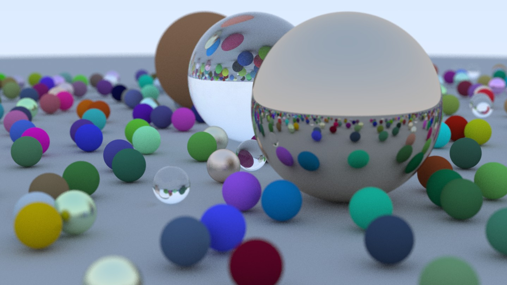

# Ray Tracer

A physically-based ray tracer written from scratch in modern C++. Implements geometric ray–object intersection, surface shading, and recursive path tracing to produce photorealistic renders of 3D scenes.



## Overview

A CPU ray tracer. It supports configurable cameras, multiple physically-based material types, and renders scenes containing hundreds of spheres with realistic lighting effects including reflections, refractions, and depth of field.

The renderer writes PPM image output to `stdout`, so it composes naturally with shell pipelines. The project has no external dependencies, only the C++ standard library, and is built with CMake.

## Features

**Physically Based Materials**

- Lambertian (matte) diffuse surfaces
- Metal with configurable fuzziness for rough reflections
- Dielectric glass with Snell's law refraction and Schlick-approximated reflectance

**Realistic Camera Model**

- Positionable camera with configurable field of view
- Thin-lens depth of field via defocus disk sampling
- Adjustable focus distance

**Sampling and shading**

- Stochastic supersampling (antialiasing) with configurable samples per pixel
- Recursive path tracing with bounce-depth control
- Gamma-corrected colour output
- Front/back face detection for correct inside/outside surface behaviour

**Scene construction**

- Polymorphic `hittable` interface for extensible geometry
- Efficient closest-hit traversal over scene object lists

## Tech Stack

- **Language:** C++17
- **Build system:** CMake
- **Compiler tested:** GCC 15.2.0 (MSYS2 UCRT64)
- **Dependencies:** C++ standard library only

## Building

### Prerequisites

- A C++17-compliant compiler (GCC, Clang, or MSVC)
- CMake 3.10 or newer

### Configure and build

```bash
cmake -B build
cmake --build build
```

On Windows with MSYS2/MinGW, specify the generator explicitly:

```powershell
cmake -B build -G "MinGW Makefiles"
cmake --build build
```

## Running

The renderer writes a PPM image to standard output. Redirect it to a file:

```bash
./build/raytracer > image.ppm
```

On PowerShell:

```powershell
.\build\raytracer.exe | Out-File -Encoding ascii image.ppm
```

Scene configuration, camera parameters, and render quality settings (image width, samples per pixel, max bounce depth) are defined in `src/main.cpp`.

## Project Structure

```text
src/
├── main.cpp          — Scene setup and render entry point
├── common.h          — Shared constants, RNG, and common includes
├── vec3.h            — 3D vector math (also aliased as point3 and colour)
├── ray.h             — Ray primitive
├── interval.h        — Numeric interval helper for ray parameter bounds
├── colour.h          — Gamma correction and PPM pixel output
├── camera.h          — Camera, viewport, sampling, and ray-colour integrator
├── hittable.h        — Abstract base for intersectable geometry
├── hittable_list.h   — Scene container with linear closest-hit traversal
├── sphere.h          — Ray–sphere intersection
└── material.h        — Material base + lambertian, metal, and dielectric
```

## Future Improvements

- [ ] Motion blur for moving objects
- [ ] Bounding volume hierarchies (BVH) to accelerate rendering of complex scenes
- [ ] Texture maps for image-based surface detail
- [ ] Perlin noise for procedural textures
- [ ] Quadrilateral primitives (foundation for disks, triangles, rings, and other 2D surfaces)
- [ ] Light sources
- [ ] Transforms for placing and rotating objects
- [ ] Volumetric rendering for smoke, clouds, and other participating media
